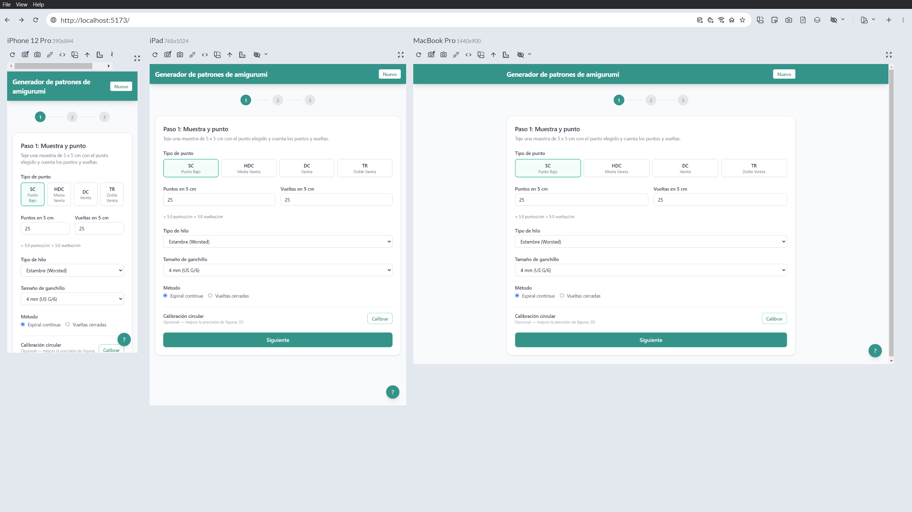
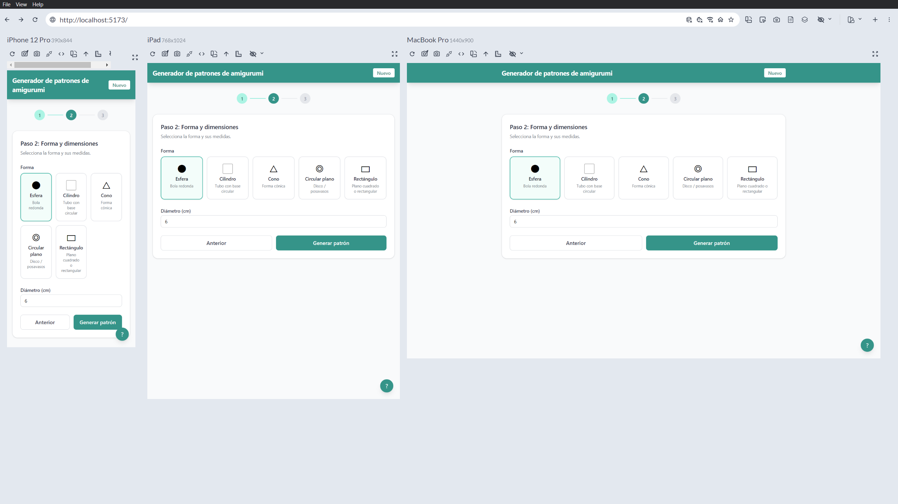
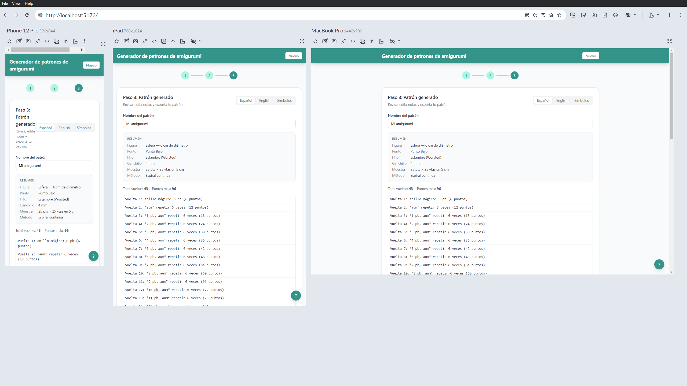
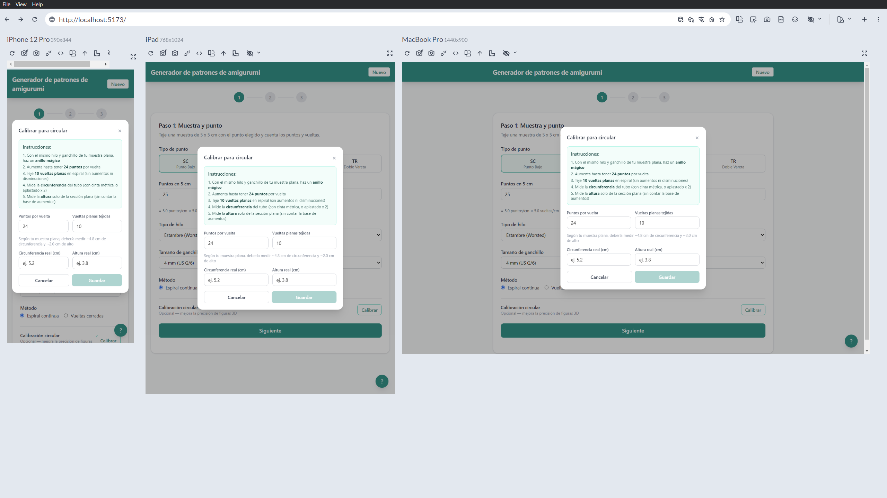
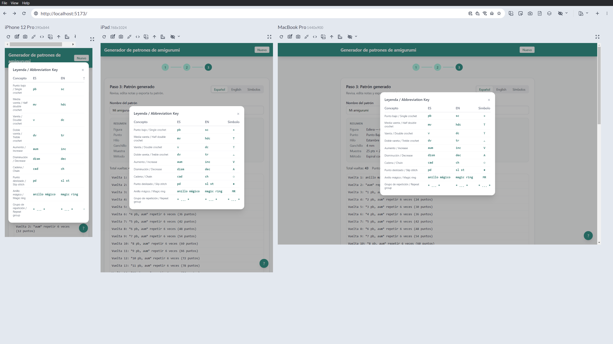

# Amigurumi Pattern Generator

Generador de patrones de amigurumi (crochet) basado en formas geom&eacute;tricas. Ingresa los datos de tu muestra, selecciona una forma y sus dimensiones, y obt&eacute;n un patr&oacute;n completo con aumentos y disminuciones calculados autom&aacute;ticamente.


## Caracter&iacute;sticas

- **5 formas geom&eacute;tricas**: esfera, cilindro, cono, c&iacute;rculo plano y rect&aacute;ngulo plano
- **4 tipos de punto**: punto bajo, media vareta, vareta y doble vareta
- **3 sistemas de nomenclatura**: espa&ntilde;ol, ingl&eacute;s y s&iacute;mbolos est&aacute;ndar
- **Calibraci&oacute;n circular**: correcci&oacute;n personalizada de la muestra plana para figuras 3D
- **Resumen del patr&oacute;n**: datos de muestra, materiales y dimensiones incluidos en la vista y el archivo exportado
- **Exportaci&oacute;n**: copiar al portapapeles o descargar como `.txt`
- **Persistencia local**: patrones guardados en `localStorage`

## Tecnolog&iacute;as

| Categor&iacute;a | Tecnolog&iacute;a |
|---|---|
| Framework | React 19 |
| Lenguaje | TypeScript 5.9 |
| Bundler | Vite 7 |
| Estilos | Tailwind CSS 4 |
| Testing | Vitest + Testing Library |
| Persistencia | localStorage (client-side) |

## Requisitos previos

- [Node.js](https://nodejs.org/) v18 o superior
- npm (incluido con Node.js)

## Instalaci&oacute;n

```bash
git clone <url-del-repositorio>
cd amigurumi-pattern-generator
npm install
```

## Uso

```bash
# Servidor de desarrollo
npm run dev

# Build de producci&oacute;n
npm run build

# Preview del build
npm run preview

# Tests
npm run test        # modo watch
npm run test:run    # ejecuci&oacute;n &uacute;nica
```

## C&oacute;mo funciona

La aplicaci&oacute;n es un wizard de 3 pasos:

### Paso 1 — Muestra y punto

Se ingresa la muestra tejida en plano (puntos y vueltas en 5 cm), el tipo de punto, grosor de hilo, tama&ntilde;o de ganchillo y m&eacute;todo (espiral continua o vueltas cerradas). Opcionalmente se puede calibrar la muestra para trabajo circular.



### Paso 2 — Forma y dimensiones

Se selecciona la forma geom&eacute;trica y se ingresan las dimensiones en cent&iacute;metros.



### Paso 3 — Patr&oacute;n generado

Se muestra el patr&oacute;n completo con un resumen de los datos ingresados, instrucciones vuelta por vuelta, y opciones para cambiar nomenclatura, editar notas, guardar y exportar.



### Calibraci&oacute;n circular (opcional)

Para mejorar la precisi&oacute;n en figuras 3D, se puede tejer un peque&ntilde;o tubo de muestra y medir su circunferencia y altura. El sistema calcula factores de correcci&oacute;n personalizados que ajustan la diferencia entre la muestra plana y el tejido circular.



### Leyenda de nomenclatura

Accesible desde cualquier paso mediante un bot&oacute;n flotante. Muestra la equivalencia de t&eacute;rminos en los tres sistemas de nomenclatura.



## Estructura del proyecto

```
src/
├── types/              # Tipos e interfaces (gauge, pattern, calibration, notation)
├── engine/             # L&oacute;gica de c&aacute;lculo pura (sin React)
│   ├── shapes/         # Generadores por forma (sphere, cylinder, cone, etc.)
│   ├── stitches.ts     # Propiedades de cada tipo de punto
│   └── pattern-generator.ts  # Orquestador principal
├── notation/           # Diccionarios ES/EN/S&iacute;mbolos y formateador
├── components/         # Componentes React
│   ├── gauge/          # Formulario de muestra y modal de calibraci&oacute;n
│   ├── shape/          # Selector de forma y dimensiones
│   ├── pattern/        # Vista del patr&oacute;n, resumen y edici&oacute;n
│   ├── stitch/         # Selector de tipo de punto
│   ├── notation/       # Toggle de nomenclatura y leyenda
│   ├── export/         # Bot&oacute;n de exportaci&oacute;n
│   └── layout/         # Header y layout general
├── hooks/              # usePattern, useLocalStorage
├── context/            # NotationContext (idioma activo)
└── data/               # Cat&aacute;logos de hilos y ganchillos
```

## Testing

El proyecto incluye 43 tests unitarios que cubren:

- C&aacute;lculos de muestra y conversi&oacute;n de unidades
- Generaci&oacute;n de esfera (aumentos, zona media, disminuciones)
- Generaci&oacute;n de cilindro
- Formas planas (c&iacute;rculo y rect&aacute;ngulo)
- Orquestador de patrones
- Formateador de nomenclatura

```bash
npm run test:run
```

## Licencia

MIT
